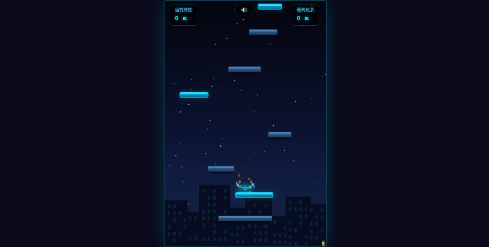

# 🚁 雾都飞升：无人机挑战

> 一款基于 Web 技术开发的跑酷类 H5 小游戏，无需安装，打开即玩。

[🌐 在线体验](https://daka-agent.github.io/drone-runner/) · [📥 下载 ZIP](https://github.com/daka-agent/drone-runner/archive/refs/heads/main.zip)

> ⚠️ 首次上传后需在 GitHub 仓库 **Settings → Pages** 中启用 Pages，并将上方链接替换为你的实际地址。

---

## 🎮 游戏说明

**雾都飞升** 是一款以赛博朋克都市为背景的无人机无尽跑酷游戏。

```
摁下空格键  →  开始游戏
← → 方向键  →  控制左右移动
```

无人机将 **自动持续跳跃**，玩家只需控制左右方向，引导无人机跳上越来越高的平台。随着高度增加，游戏速度会逐渐加快，直到无人机不慎坠落……

---

## ✨ 游戏特色

| 特性 | 说明 |
|------|------|
| 🕹️ **纯前端实现** | HTML + CSS + JavaScript，无任何外部依赖 |
| 🎨 **雾都赛博朋克风格** | 霓虹灯光、建筑剪影、星空雾气氛围 |
| 🔊 **程序化音效** | Web Audio API 合成，无需音频文件 |
| 📱 **移动端适配** | 支持触摸左右分屏控制 |
| 🏆 **无尽模式** | 实时记录当前高度与历史最高 |
| ⚡ **速度递增** | 游戏时间越长，速度越快，挑战性越高 |
| 🔄 **环绕穿墙** | 飞出屏幕边缘将从对侧出现 |

---

## 🛠️ 本地运行

### 方法一：直接打开
下载后双击 `index.html`，用任意现代浏览器（Chrome / Edge / Firefox / Safari）打开即可。

### 方法二：本地服务器
```bash
# Python 3
python -m http.server 8080

# Node.js
npx serve .

# PHP
php -S localhost:8080
```
然后访问 `http://localhost:8080`

---

## 📁 项目结构

```
drone-runner/
├── index.html          # 游戏主入口（所有代码均在单文件中）
├── README.md           # 项目说明文档
├── LICENSE             # MIT 开源许可证
└── .gitignore          # Git 忽略配置
```

---

## 🎨 音效系统

游戏使用 **Web Audio API** 程序化合成所有音效，无需加载任何音频文件：

| 音效 | 触发时机 |
|------|---------|
| 🚀 起跳音 | 无人机每次弹跳 |
| 👣 落地音 | 踩上平台瞬间 |
| 🎉 里程碑音 | 每上升 50 米 |
| 💥 坠落音 | 游戏结束时 |
| 🎶 启动音 | 游戏开始时 |

> 点击右上角 **🔊** 按钮可随时静音。

---

## 📸 游戏截图



---

## 🤝 参与贡献

欢迎提交 Issue 和 Pull Request！

1. Fork 本仓库
2. 创建特性分支 (`git checkout -b feature/AmazingFeature`)
3. 提交更改 (`git commit -m 'Add some AmazingFeature'`)
4. 推送到分支 (`git push origin feature/AmazingFeature`)
5. 开启 Pull Request

---

## 📜 开源许可

本项目基于 [MIT License](LICENSE) 开源。

---

> Made with ❤️ by [daka-agent](https://github.com/daka-agent)
